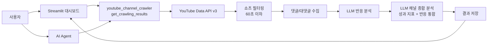
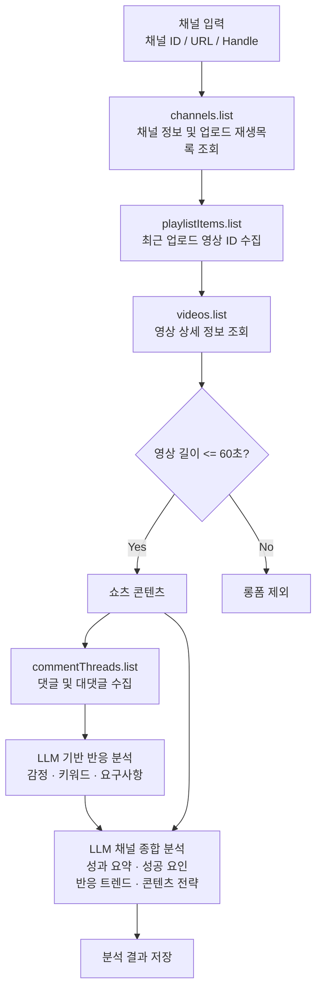
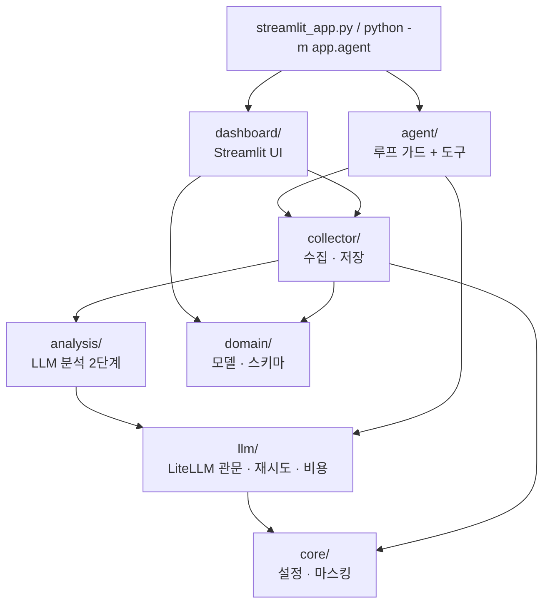

# 유튜브 쇼츠 채널 분석 에이전트

60초 이하 **유튜브 쇼츠 콘텐츠만 수집**하고, 댓글·대댓글 기반으로 시청자 반응을 분석하는 Docker 기반 AI 에이전트입니다.

일반 롱폼 영상은 분석 대상에서 제외하며, YouTube Data API v3를 활용해 쇼츠 콘텐츠 성과와 댓글 반응 데이터를 수집합니다.

---

## 1. 시스템 구조



---

## 2. 에이전트 수집 파이프라인



2단계 분석입니다. 먼저 댓글만 보고 반응을 정리하고(`analyze_comments`),
그 결과에 **쇼츠 전편의 메타데이터(조회수·좋아요·영상 길이·게시 빈도)** 를 얹어
채널 전반을 종합합니다(`analyze_channel`). 종합 분석은 지표만으로도 동작하므로
댓글 분석이 실패하거나 댓글이 없는 채널에서도 리포트가 생성됩니다.

핵심 설계는 **쇼츠 필터링을 댓글 수집 이전 단계에서 수행하는 것**입니다.

이를 통해 롱폼 영상에 대한 불필요한 댓글 API 호출을 방지하고 YouTube API 쿼터 사용량을 줄입니다.

---

## 3. 주요 기능

## AI Agent

### `youtube_channel_crawler`

채널 데이터를 수집하고 쇼츠 콘텐츠 및 댓글 반응 분석을 수행합니다.

수집 과정:

1. `channels.list`
   - 채널 프로필 정보 수집
   - 채널 통계 정보 수집
   - 업로드 재생목록 ID 조회

2. `playlistItems.list`
   - 최근 업로드 영상 ID 수집

3. `videos.list`
   - 영상 상세 정보 조회
   - 재생시간 확인
   - 60초 이하 쇼츠만 선별

4. `commentThreads.list`
   - 쇼츠 댓글 및 대댓글 수집

5. LLM 반응 분석 (`analyze_comments`)
   - 댓글 요약
   - 긍정/부정 감정 분석
   - 주요 키워드 및 요구사항 추출

6. LLM 채널 종합 분석 (`analyze_channel`)
   - 쇼츠 전편의 성과 지표(조회수·좋아요·영상 길이·게시 빈도)와 5의 반응 결과를 통합
   - 채널 핵심 성과 요약 / 인기 쇼츠 성공 요인 / 시청자 반응 트렌드 / 향후 콘텐츠 전략


### `get_crawling_results`

저장된 쇼츠 채널 분석 결과를 반환합니다.

포함 데이터:

- 채널 정보
- 쇼츠 성과 데이터 (게시 빈도·평균 영상 길이 포함)
- 댓글 및 대댓글 데이터
- 시청자 반응 분석 결과 (`analysis`)
- 채널 종합 분석 결과 (`channel_overall_analysis`)

---

## 4. 웹 대시보드

Streamlit 기반 대시보드에서 수집 결과를 확인할 수 있습니다.

제공 기능:

### 채널 핵심 지표

- 구독자 수
- 총 조회수
- 쇼츠 평균 조회수
- 평균 좋아요 수
- 쇼츠 게시 빈도 (주당 편수 / 평균 게시 간격)
- 수집 댓글 수

### 채널 종합 분석 리포트

지표 바로 아래에 **시각적으로 강조된 영역**으로 표시됩니다.
수집한 쇼츠 전편의 성과 지표와 시청자 댓글 반응을 한 번에 놓고 Claude가 작성합니다.

| 구성 | 내용 |
|---|---|
| 핵심 진단 (headline) | 채널 상태를 한 줄로 |
| ① 채널 핵심 성과 요약 | 총평 + 수치 근거 하이라이트 |
| ② 인기 쇼츠 성공 요인 | 요인, 지표·댓글 근거, 대표 쇼츠 |
| ③ 시청자 반응 트렌드 | 트렌드, 지배 감정, 관측 근거 |
| ④ 향후 콘텐츠 전략 제안 | 실행 액션, 근거, 기대 효과, 우선순위 |
| 리스크 | 방치하면 성과를 갉아먹을 요소 |

프롬프트에는 길이 구간별 평균 성과, 월별 게시 편수와 평균 조회수, 쇼츠 전편 성과 표,
공감 상위 댓글이 함께 들어가므로 "조회수가 높다" 수준이 아니라
"상위 영상은 길이가 짧고 댓글에서 전개가 빠르다는 반응이 반복된다" 형태의 교차 해석이 나옵니다.

### 인기 쇼츠 분석

- 조회수 기반 인기 쇼츠 랭킹
- 좋아요 및 댓글 지표 확인

### 댓글 반응 분석

- LLM 기반 댓글 요약
- 주요 키워드 추출
- 긍정/부정 의견 분석
- 주요 댓글 및 대댓글 확인

### 데이터 시각화

- 조회수 대비 좋아요 관계 차트

### 데이터 다운로드

채널명 오른쪽 상단의 **📊 리포트 받기 (CSV)** 버튼으로 바로 받을 수 있고,
하단 **데이터 내려받기** 섹션에서는 CSV와 JSON을 파일 설명과 함께 받을 수 있습니다.

| 버튼 | 파일 | 내용 |
|---|---|---|
| 📊 리포트 받기 (CSV) / ⬇ CSV 내려받기 | `shorts_{채널}_{수집일}.csv` | 쇼츠 1편 = 1행. 성과 지표 11열 + 댓글 반응 9열 (두 버튼은 같은 파일) |
| ⬇ JSON 내려받기 | `comments_{채널}_{수집일}.json` | 영상별로 묶인 댓글 스레드 **전량**. 대댓글 포함, 본문 길이 제한 없음 |

CSV 열 구성:

- 성과 지표 — 영상ID, 제목, 게시일, 길이(초), 조회수, 좋아요, 댓글, 좋아요율(%), 댓글율(%), 태그, 링크
- 댓글 반응 — 수집스레드수, 수집댓글수(대댓글포함), 주요댓글작성자, 주요댓글, 주요댓글좋아요,
  주요댓글대댓글, 댓글·대댓글전문, 반응요약(LLM), 지배감정(LLM)

`댓글·대댓글전문`은 그 쇼츠에 달린 스레드를 좋아요 순으로 묶은 텍스트입니다.

```
[♥1,203] 시청자A: 편집 속도가 딱 좋아요
    ↳ [♥12] 채널주인: 감사합니다!
    ↳ (미수집 대댓글 3개)

[♥887] 시청자B: 자막이 너무 빨리 지나가요
```

- CSV는 UTF-8 BOM으로 저장되어 Excel에서 한글이 깨지지 않습니다.
- Excel 셀 상한(32,767자)을 넘는 분량은 `… 이하 N개 스레드 생략` 으로 잘립니다. 전문은 JSON을 받으세요.
- JSON은 LLM 분석에 사용한 축약본이 아니라 수집한 원본 그대로입니다.
  각 스레드의 `total_reply_count`(YouTube가 보고한 전체 대댓글 수)와
  `collected_reply_count`(실제 수집된 수)를 함께 담아 전량 여부를 확인할 수 있습니다.

---

## 5. 실행 방법

### Docker 실행

```bash
cp .env.example .env
docker compose up --build
```

실행 후 브라우저에서 접속:

```
http://localhost:8501
```

---

## 6. 환경 변수

`.env.example`을 참고하여 환경 변수를 설정합니다.

| 변수 | 설명 |
|---|---|
| `ANTHROPIC_API_KEY` | LLM 분석 API 키 |
| `DATA_DIR` | 수집 결과 저장 경로 |
| `YOUTUBE_API_KEY` | **CLI 에이전트 전용** 폴백 키. 대시보드는 읽지 않습니다 |
| `SERVER_PUBLIC_IP` | 키 제한 안내에 표시할 서버 고정 IP (선택) |
| `SESSION_DATA_TTL_DAYS` | 세션별 수집 결과 보존 기간, 기본 7일 (0 이면 보관) |

실제 키가 포함된 `.env` 파일은 `.gitignore`를 통해 커밋되지 않습니다.

> **YouTube API 키는 사용자가 화면에서 직접 입력합니다.** 사이드바에 넣은 키는 해당 세션의
> 서버 메모리에만 머물고 디스크·로그·수집 결과 파일 어디에도 기록되지 않습니다. 수집 결과도
> 세션 단위로 격리되어 다른 접속자에게 보이지 않습니다.

---

## 7. 프로젝트 구조

기능별 패키지로 나뉘어 있고, **의존 방향은 항상 아래로만** 흐릅니다
(`core` 는 아무것도 임포트하지 않고, `dashboard`/`agent` 는 아무도 임포트하지 않습니다).

```
app/
├── core/         설정(config) · 마스킹과 로깅(security)
├── domain/       수집 모델(models) · LLM 출력 스키마(analysis)
├── llm/          LiteLLM 단일 관문(gateway) · 재시도(retry) · 단가(pricing) · 사용량(usage)
├── collector/    YouTube 클라이언트(youtube) · 수집 파이프라인(crawler) · 저장소(store)
├── analysis/     프롬프트(prompts) · 페이로드(payloads) · 댓글(comments) · 채널 종합(channel)
├── agent/        도구 정의(tools) · 루프 가드(loop) · CLI(cli)
└── dashboard/    진입점(app) · 세션 상태(state) · 사이드바 · 섹션 · 차트 · 위젯 · 템플릿/테마
```



### LLM 호출 계층

모든 LLM 호출은 **LiteLLM 을 경유**하며, 그 통로는 `app/llm/gateway.py` 하나뿐입니다.
`litellm` 을 직접 임포트하는 파일은 gateway 와 retry 둘뿐이라, 재시도·토큰 집계·비용
로깅·키 마스킹이 새 호출부에서 빠질 수 없습니다.

| 관심사 | 위치 | 동작 |
|---|---|---|
| 라우팅 | `gateway.resolve_model()` | 모델명에 `/` 가 없으면 `anthropic/` 접두사를 붙임 (`LLM_PROVIDER`) |
| 재시도 | `llm/retry.py` | 429·타임아웃·연결 오류·5xx 만 지수 백오프로 재시도. `retry-after` 헤더가 오면 그 값을 우선. **폴백 체인 없음** |
| 비재시도 | `llm/retry.py` | 인증·권한·잘못된 요청은 즉시 중단 (같은 요청은 다시 보내도 같은 실패) |
| 토큰·비용 | `llm/usage.py` · `llm/pricing.py` | 호출 1건 = JSON 로그 한 줄. 단가표에 없는 모델은 `cost_usd: null` (0 이 아님) |
| 구조화 출력 | `gateway.complete_structured()` | Pydantic 스키마로 검증. 본문이 비면 도구 호출 인자에서 회수 |

```
INFO app.llm.usage: {"event":"llm_call","label":"analysis.comments","status":"ok",
                     "model":"claude-opus-5","input_tokens":8412,"output_tokens":1930,
                     "total_tokens":10342,"cost_usd":0.09031,"latency_ms":18422,"attempts":1}
```

관련 환경변수: `LLM_MAX_RETRIES`(기본 4) · `LLM_RETRY_BASE_DELAY`(1.0초) ·
`LLM_RETRY_MAX_DELAY`(30초) · `LLM_MAX_TOKENS` · `LLM_TIMEOUT_SEC`.

### 에이전트 루프 가드

`app/agent/loop.py` 는 도구 호출 왕복을 `AGENT_MAX_ITERATIONS`(기본 **5**)회로 제한합니다.

- **상한 도달 시** 빈손으로 끝내지 않고 도구를 뗀 채 한 번 더 호출해, 그때까지 모은 것으로
  최종 답변을 만들게 합니다 (`status="max_iterations"`).
- **도구가 실패해도 예외를 올리지 않습니다.** 모르는 도구 이름, 깨진 JSON 인자, 잘못된 인자
  이름, 도구 내부 예외 — 전부 `{"error": ...}` 로 모델에게 되돌려, 모델이 인자를 고쳐
  재시도하거나 다른 도구를 고르게 합니다.
- **LLM 호출 자체의 실패는 흡수하지 않습니다** — 모델이 고칠 수 있는 문제가 아니므로
  `status="error"` 로 즉시 끝냅니다.

`run_agent()` 는 예외 대신 `AgentResult`(답변·상태·반복 횟수·도구 호출 수·누적 사용량·전체
대화)를 돌려주므로, 중단된 실행에서도 히스토리와 비용이 그대로 남습니다.

### 마크업 분리 규칙

파이썬 코드에는 HTML·CSS 문자열을 두지 않습니다.

```
web/index.html             태그와 클래스 (Jinja2 매크로)
web/styles.css             색·여백·레이아웃 (var(--토큰) 참조만)
app/dashboard/theme.py     색상 토큰의 단일 진실 공급원
app/dashboard/templates.py 위 셋을 묶어 데이터만 바인딩
```

- `dashboard/sections.py` 는 `widgets.html("매크로명", 데이터)` 로 조각을 받아 출력합니다.
- `styles.css` 는 색을 리터럴로 갖지 않고 `var(--surface)` 처럼 참조만 합니다.
  실제 값은 `theme.py` 토큰에서 만들어 `:root` 로 주입되므로(`templates.stylesheet()`),
  팔레트를 바꿀 때 CSS 파일은 건드릴 필요가 없고 파이썬 f-string 중괄호 이스케이프 문제도 없습니다.
- Jinja2 autoescape가 켜져 있어 채널명·댓글 본문 등 사용자 데이터는 자동으로 이스케이프됩니다
  (호출부에서 `html.escape` 를 미리 걸면 이중 이스케이프가 됩니다).

#### 태그가 화면에 원문으로 찍히지 않게 하는 두 장치

`st.markdown(unsafe_allow_html=True)` 은 문자열을 **마크다운으로 먼저 파싱**합니다.
이 특성 때문에 두 가지 처리가 렌더 경로에 들어가 있습니다.

| 장치 | 위치 | 막는 것 |
|---|---|---|
| `templates.flatten()` | 모든 `render()` 반환값 | 빈 줄이 HTML 블록을 끊고, 뒤이은 들여쓴 줄이 **코드 블록**으로 파싱되어 `<div>` 가 텍스트로 노출되는 현상 |
| `formatting.plain()` | LLM이 쓴 필드 (`\| plain` 필터 / `st.markdown` 호출부) | 모델이 뱉은 `<b>`, `**굵게**`, `### 제목` 등이 기호 그대로 남는 현상 |

`plain()` 은 `view_count` 같은 밑줄 식별자와 `3 < 5` 같은 부등호는 보존합니다.
분석 프롬프트에도 "모든 필드는 서식 없는 평문으로" 지시가 들어가 있어, 세 겹으로 막습니다.

---

## 8. Docker 구성

프로젝트는 Docker 환경에서 실행할 수 있도록 구성되어 있습니다.

포함 구성:

- Dockerfile
- docker-compose.yml
- 환경 변수 기반 설정
- Streamlit 웹 서버 실행

---

## 9. 제한 사항

- 60초 초과 영상은 분석 대상에서 제외됩니다.
- 댓글 기능이 비활성화된 영상은 분석에서 제외됩니다.
- YouTube Data API 쿼터 제한의 영향을 받습니다.
- LLM 분석은 API 키 설정 시 활성화됩니다.