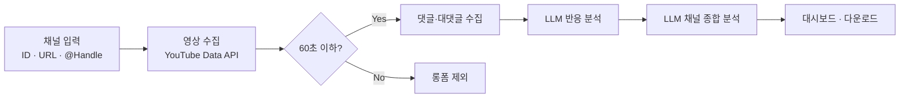

# 유튜브 쇼츠 채널 분석 에이전트

유튜브 채널의 **60초 이하 쇼츠만** 골라 성과 지표와 댓글·대댓글 반응을 수집하고, LLM으로 채널 종합 분석 리포트를 만들어 주는 Docker 기반 AI 에이전트입니다.

## ✨ 핵심 특징

- **쇼츠 전용 수집** — 롱폼은 댓글 수집 이전 단계에서 제외해 YouTube API 쿼터를 아낍니다.
- **2단계 LLM 분석** — 댓글 반응 분석 → 성과 지표와 합친 채널 종합 분석. 댓글이 없어도 리포트가 생성됩니다.
- **웹 대시보드 + CLI 에이전트** — 브라우저에서 바로 보거나, 자연어 요청으로 CLI에서 실행할 수 있습니다.
- **키·데이터 격리** — 대시보드의 YouTube API 키는 세션 메모리에만 머물고, 수집 결과도 세션별로 분리됩니다.

---

## 🛠 기술 스택

| 구분 | 사용 기술 |
|---|---|
| 언어 | Python 3.12 |
| 대시보드 | Streamlit, Plotly, Jinja2 |
| 데이터 수집 | YouTube Data API v3 (`google-api-python-client`) |
| LLM | LiteLLM → Anthropic Claude |
| 데이터 처리·검증 | pandas, Pydantic |
| 인프라 | Docker, Docker Compose, Nginx, Certbot |

---

## 🧩 주요 기능


```mermaid
flowchart LR
    A["채널 입력<br/>ID · URL · @Handle"] --> B["영상 수집<br/>YouTube Data API"]
    B --> C{"60초 이하?"}
    C -->|Yes| D["댓글·대댓글 수집"]
    C -->|No| X["롱폼 제외"]
    D --> E["LLM 반응 분석"]
    E --> F["LLM 채널 종합 분석"]
    F --> G["대시보드 · 다운로드"]
```

| 기능 | 설명 |
|---|---|
| 채널 핵심 지표 | 구독자·총 조회수·쇼츠 평균 조회수/좋아요·게시 빈도·수집 댓글 수 |
| 채널 종합 분석 리포트 | 핵심 진단, 성과 요약, 인기 쇼츠 성공 요인, 시청자 반응 트렌드, 콘텐츠 전략 제안, 리스크 |
| 인기 쇼츠 분석 | 조회수 기준 랭킹, 좋아요·댓글 지표 |
| 댓글 반응 분석 | 댓글 요약, 긍정/부정 감정, 주요 키워드·요구사항, 주요 댓글 |
| 데이터 시각화 | 조회수 대비 좋아요 관계 차트 |
| 데이터 다운로드 | 쇼츠별 CSV 리포트(Excel 호환) · 댓글 원본 전량 JSON |
| AI 에이전트 도구 | `youtube_channel_crawler`(수집·분석), `get_crawling_results`(저장 결과 조회) |

---

## 🚀 실행 방법

### 1. 환경 변수 설정

```bash
cp .env.example .env
# .env 에 ANTHROPIC_API_KEY 입력
```

### 2. 실행

| 용도 | 명령어 | 접속 주소 |
|---|---|---|
| 로컬 대시보드 | `docker compose up --build` | http://localhost:8501 |
| 운영 배포 (Nginx + HTTPS) | `docker compose -f docker-compose.yml -f docker-compose.prod.yml up -d --build` | https://`<도메인>` |
| CLI 에이전트 | `docker compose exec shorts-agent python -m app.agent "@채널핸들 쇼츠 반응 분석해줘"` | — |

> 대시보드에서는 **YouTube API 키를 사이드바에 직접 입력**합니다.

### 3. 환경 변수

| 변수 | 필수 | 기본값 | 설명 |
|---|:---:|---|---|
| `ANTHROPIC_API_KEY` | ✅ | — | LLM 분석용 API 키 |
| `YOUTUBE_API_KEY` | | — | CLI 에이전트 전용 키 (대시보드는 사용하지 않음) |
| `SERVER_PUBLIC_IP` | | — | API 키 IP 제한 안내에 표시할 서버 IP |
| `SESSION_DATA_TTL_DAYS` | | `7` | 세션별 수집 결과 보존 기간(일), `0`이면 계속 보관 |
| `CLAUDE_MODEL` | | `claude-opus-5` | 분석에 사용할 모델 |
| `SHORTS_MAX_DURATION_SEC` | | `60` | 쇼츠 판별 기준(초) |
| `MAX_VIDEOS` | | `60` | 채널당 최대 수집 영상 수 |
| `MAX_COMMENTS_PER_VIDEO` | | `50` | 영상당 최대 댓글 수 |
| `COMMENT_TARGET_VIDEO_COUNT` | | `15` | 댓글을 수집할 상위 쇼츠 수 |
| `DATA_DIR` | | `/data` | 수집 결과 저장 경로 |

LLM 재시도·타임아웃·에이전트 반복 한도 등 세부 옵션은 [`.env.example`](.env.example)을 참고하세요.

---

## ✅ Docker · 환경 설정 체크포인트

- [ ] `.env`는 `.gitignore`로 커밋되지 않습니다. 실제 키는 `.env`에만 넣으세요.
- [ ] 공개 서버에서는 `YOUTUBE_API_KEY`를 비워 두세요. 채우면 CLI 경로가 운영자 쿼터를 사용합니다.
- [ ] 수집 결과는 `shorts-data` 볼륨(`/data`)에 영속화됩니다.
- [ ] 로컬 compose는 `app/`·`web/` 소스를 마운트하므로 코드 수정이 새로고침으로 반영됩니다.
- [ ] 운영 compose는 브라우저 에러 상세를 숨기고, Nginx로 HTTPS를 처리합니다. `nginx.conf`의 도메인을 환경에 맞게 수정하세요.
- [ ] 헬스체크: `http://localhost:8501/_stcore/health`

---

## 📁 프로젝트 구조

```
├── app/
│   ├── core/         설정 · 로그 마스킹
│   ├── domain/       수집 모델 · LLM 출력 스키마
│   ├── llm/          LiteLLM 관문 · 재시도 · 토큰/비용 집계
│   ├── collector/    YouTube 클라이언트 · 수집 파이프라인 · 저장소
│   ├── analysis/     프롬프트 · 댓글 분석 · 채널 종합 분석
│   ├── agent/        도구 정의 · 루프 가드 · CLI
│   └── dashboard/    Streamlit UI (섹션 · 차트 · 템플릿/테마)
├── web/              대시보드 HTML 템플릿 · CSS
├── streamlit_app.py  대시보드 진입점
├── Dockerfile
├── docker-compose.yml / docker-compose.prod.yml
└── nginx.conf
```

---

## ⚠️ 제한 사항

- 60초 초과 영상과 댓글이 비활성화된 영상은 분석에서 제외됩니다.
- YouTube Data API 일일 쿼터의 영향을 받습니다.
- LLM 분석은 `ANTHROPIC_API_KEY` 설정 시에만 동작합니다.
